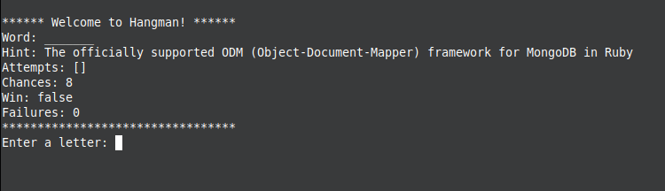
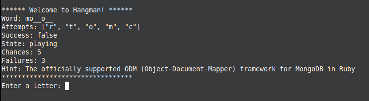
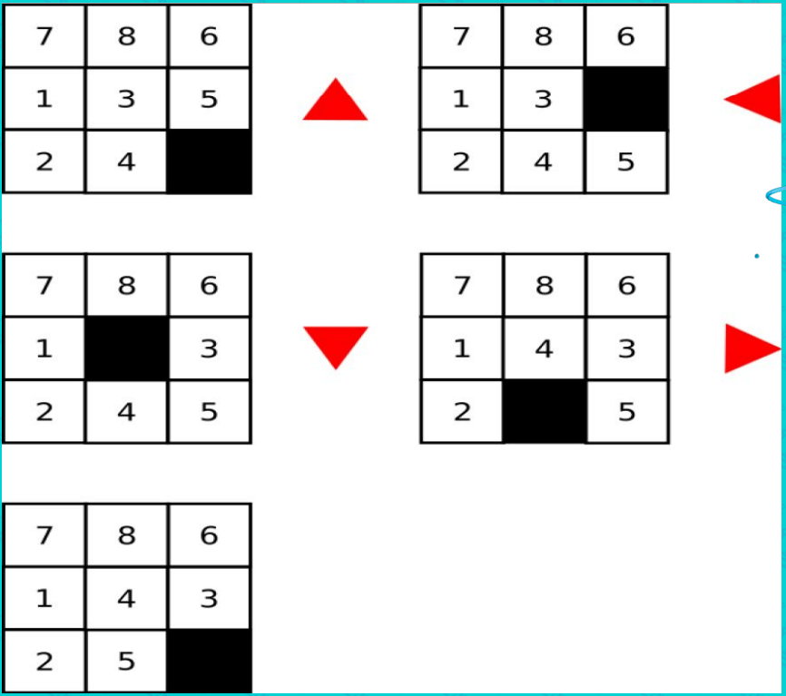

# SuperLikersChallenge

This project is a challenge for SuperLikers. Here you can find some games and the solution for 3 challenges.

### Installing.

1. **Clone the repository**:
    ```bash
    git clone git@github.com:jwaldimer/SuperLikersChallenge.git
    cd SuperLikersChallenge
    ```

2. **Install MongoDB**:

    This project ude MongoDB as main database

3. **Install dependencies**:
    ```bash
    bundle install
    ```
3. **Run setup**:
    ```bash
    ruby bin/setup.rb
    ```
4. **Install and run Rackup**:
    ```bash
    gem install rackup
    rackup
    ```
## CHALLENGE 1

Modify the above program to provide the hint only after 3 failed attempts.

To solve this challenge a small change must be added to the endpoint:

`GET /hangman/:pid/try/:letter`

to add the hint only after 3 failed attemps.

```ruby
  r_hash = {
  word: @game.c,
  attempts: @game.a.to_a,
  success: ok,
  state: @game.state,
  chances: 8 - @game.f,
  failures: @game.f,
  }

  r_hash.merge!( hint: @game.h ) if @game.f >= 3
```
## CHALLENGE 2

Implement a terminal client to play hangman using the API provided by the program you downloaded.

In order to create a terminal client to play the Hangman game I create the file:

`hangman_client.rb`

### Running the hangman client.

1. **Run Rackup**:
    ```bash
    rackup
    ```
2. **In the terminal, run hangman_client.rb**:
    ```bash
    ruby bin/hangman_client.rb
    ```
3. **Enjoy the game!**:





## CHALLENGE 3

Modify the above API to add a number puzzle game whose objective is to arrange numbers within an NxN square using the following moves:



For this challenge, I create a new game called Puzzle that create a NxN square array to play. The main endpoints are:

### 1. Create a new game with a custom array
You have to send the game ID (PID) and the size of the squate matrix. By default the size is 3x3.

**Endpoint**: `GET /puzzle/:pid/size/:size`

**Response**:
```json
{
  ':size':'3x3',
  ':grid':[[1,6,7],[5,3,8],[4,2,null]],
  ':solved': false
}
```

### 2. Move into the square matrix
You have to provide the game ID (PID) and the direction where you want to move. The options are: up, down, right, left.

**Endpoint**: `GET /puzzle/:pid/move/:direction`

**Response**:
```json
{
  ':size':'3x3',
  ':grid':[[1,6,7],[5,null,3],[4,2,8]],
  ':solved': false
}
```
## Contribution
Contributions are welcome. If you would like to contribute, please open an issue or a pull request in the repository.
